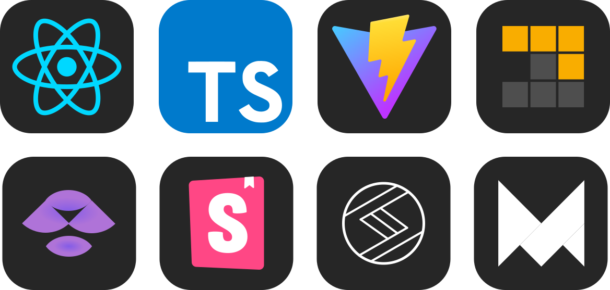

# AC Calendar

## Descrição 📕

AC Calendar is a simple application to show the birthday of a group of friends(A.C.) a mine. This application features for now only a calendar with the birthdays and the current day of the year with the respective day of the week. You can click on the day to see the birthdays of that day and the person information and even send your "Happy Birthday" via WhatsApp clicking on the green button.

<h3 align="center">

<a href="ac-calendar.vercel.app" />

«Acessar Website»

</a>

</h3>

<br>

## Preview 👓

<p align="center">

</p>

<br>

## Como Rodar 🚀

Para rodar em desenvolvimento basta baixar os arquivos do projeto via zip ou `git clone`. Após isso basta baixar as dependências e rodar o código em desenvolvimento:

```bash
> npm i
> npm run dev
```

<br>

## Todo ✅

-   [ ] Adicionar documentação com Storebook
-   [ ] Adicionar tema no local storage
-   [ ] Adicionar temas no storebook
-   [ ] Converter Svg em componentes React
-   [ ] Adicionar testes de componentes

<br>

## Tools 🛠

<p align="center">

</p>

## Entre em contato 📞

<br>

<p align="center">
<a href="https://www.linkedin.com/in/luis-felipe-vanin-martins-5a5b38215">

</a>
<a href="mailto:luisfvanin2@gmail.com">

</a>
